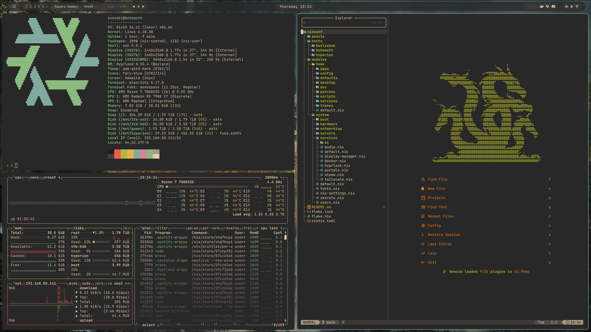
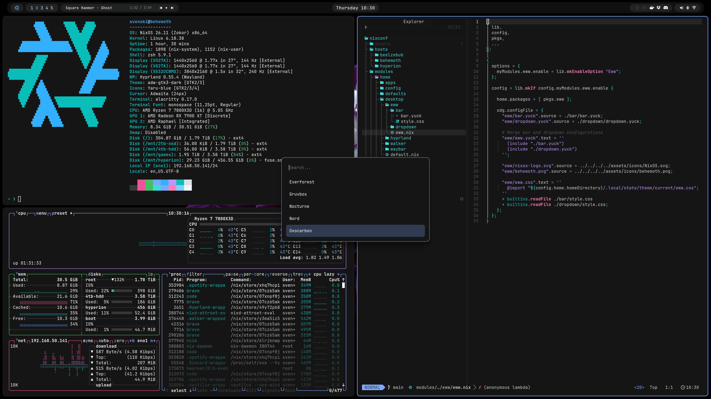

# NixOS Config

My multi-host NixOS configuration using Hyprland and Home manager.

---





---

## Hosts

### Behemoth - Desktop
Primary desktop with multiple monitors. Local AI stack running off the GPU using llama-swap.

### Beelzebub - Laptop

### Hyperion - Server
Currently just hosts dockerized game servers. File system is mounted onto Behemoth.

---

## File Structure

```
.
├── flake.nix               
├── flake.lock
├── .sops.yaml                   
│
├── hosts/
│   ├── beelzebub/
│   │   ├── configuration.nix    # System config for the laptop
│   │   ├── home.nix             
│   │   ├── hardware-configuration.nix
│   │   └── secrets.yaml
│   ├── behemoth/
│   │   ├── configuration.nix    # System config for the desktop
│   │   ├── home.nix            
│   │   ├── hardware-configuration.nix
│   │   └── secrets.yaml
│   └── hyperion/
│       ├── configuration.nix    # System config for the server
│       ├── home.nix            
│       ├── hardware-configuration.nix
│       └── secrets.yaml
│
├── modules/
│   ├── system/                  # NixOS system-level modules
│   │   ├── default.nix          
│   │   ├── nix-settings.nix
│   │   ├── fonts.nix
│   │   ├── users.nix           
│   │   ├── secrets.nix
│   │   ├── boot/
│   │   ├── hardware/
│   │   ├── networking/
│   │   │   ├── networking.nix   # systemd-networkd + iwd
│   │   │   └── vpn.nix          # Mullvad VPN
│   │   ├── services/
│   │   │   ├── audio.nix
│   │   │   ├── bluetooth.nix (via hardware/)
│   │   │   ├── docker.nix
│   │   │   ├── tailscale.nix
│   │   │   ├── steam.nix
│   │   │   ├── hyprlock.nix     # PAM service for Hyprlock
│   │   │   ├── display-manager.nix
│   │   │   ├── portals.nix
│   │   │   └── ai/
│   │   │       ├── model-schema.nix  # Shared model type + myModules.ai.{models,activeModel} options
│   │   │       ├── models.nix        
│   │   │       ├── llama-swap.nix    # llama-swap model manager + embedding server
│   │   │       ├── hermes.nix       
│   │   │       └── tools/
│   │   │           ├── honcho.nix    
│   │   │           ├── searxng.nix  
│   │   │           ├── crawl4ai.nix  
│   │   │           └── firecrawl.nix 
│   │   └── servers/
│   │       └── games/
│   │           ├── minecraft.nix
│   │           ├── valheim.nix
│   │           └── palworld.nix
│   │
│   └── home/                    # Home Manager modules
│       ├── default.nix          
│       ├── apps/                # Individually configured apps
│       │   ├── alacritty.nix
│       │   ├── btop.nix
│       │   ├── discord.nix
│       │   ├── evince.nix
│       │   ├── imv.nix
│       │   ├── keepassxc.nix
│       │   ├── nautilus.nix
│       │   ├── onlyoffice.nix
│       │   └── games/
│       ├── config/              # Core user settings
│       │   ├── settings.nix     # Bundle options (applications, desktop, services)
│       │   ├── xdg.nix          # User dirs + desktop entry overrides
│       │   └── zsh.nix
│       ├── defaults/            # Unconfigured packages
│       │   ├── default-apps.nix
│       │   └── default-utils.nix
│       ├── desktop/             # Desktop environment
│       │   ├── hyprland/        # Hyprland config split across bindings, monitors,
│       │   │                    #   windowrules, look & feel, workspaces, etc.
│       │   ├── eww/             # EWW bar + dropdown
│       │   ├── waybar/          # Waybar alternative
│       │   └── walker/          # Walker launcher config
│       ├── dev/
│       │   ├── direnv.nix
│       │   ├── neovim.nix       # LazyVim via lazyvim-nix flake
│       │   ├── opencode.nix     # OpenCode AI coding agent + Honcho plugin config
│       │   └── templates/       # Reusable devenv flakes (e.g. Python)
│       ├── patches/
│       │   └── audio.nix        # Zenbook mic boost fix
│       ├── scripts/
│       │   ├── ai-local.nix     # ai-start / ai-stop / ai-status
│       │   ├── screenshot.nix   # grim + slurp + satty
│       │   ├── theme-switcher.nix
│       │   ├── clamshell.nix
│       │   ├── waybar-media.nix
│       │   └── eww/             # EWW-specific scripts
│       ├── services/
│       │   ├── portals.nix
│       │   ├── dropbox.nix
│       │   ├── wallpaper.nix
│       │   ├── hyprlock.nix
│       │   ├── hypridle.nix
│       │   └── swayosd/
│       └── themes/              # Theme system
│           ├── default.nix      # Defines themeType + imports all targets
│           ├── first-boot.nix
│           ├── definitions/     # Nord, Gruvbox, Everforest, Oxocarbon, Nocturne
│           └── targets/         # Per-app colour file generators
│
└── assets/
    └── icons/                   # SVGs and PNGs used in EWW
```

---

## Module Design

I've tried to have everything driven by `myModules.*` options rather than direct NixOS settings. Modules are opt-in via `lib.mkEnableOption` and composed at the host level, keeping `hosts/*/configuration.nix` and `hosts/*/home.nix` as thin declaration files and allowing me to easily toggle things on/off.

The **theme system** (`modules/home/themes/`) defines a structured `themeType` and generates per-app colour files at build time. Each target module writes CSS variables or config snippets into `~/.config/themes/<name>/`, and a `theme-switcher` script symlinks the active one to `~/.local/state/theme/current/`. This means live theme changes don't require a rebuild. Themes can then be swapped between by either running `nix-theme-set <name>` or by bringing up the custom Walker menu with Super + Shift + CTRL + Space. Each theme has it's own wallpapers in `assets/wallpapers/<theme>` and these can also be swapped between using another custom Walker menu via Super + CTRL + Space.

---

## Flake Inputs

| Input | Purpose |
|---|---|
| `nixpkgs` | NixOS unstable |
| `home-manager` | User environment management |
| `sops-nix` | Secrets decryption at activation time |
| `walker` | Application launcher |
| `silentSDDM` | Minimal SDDM theme |
| `lazyvim` | LazyVim Neovim distribution |
| `hermes-agent` | NousResearch Hermes AI agent + NixOS module |
| `flake-compat` | Used to fetch hyprland-preview-share-picker |